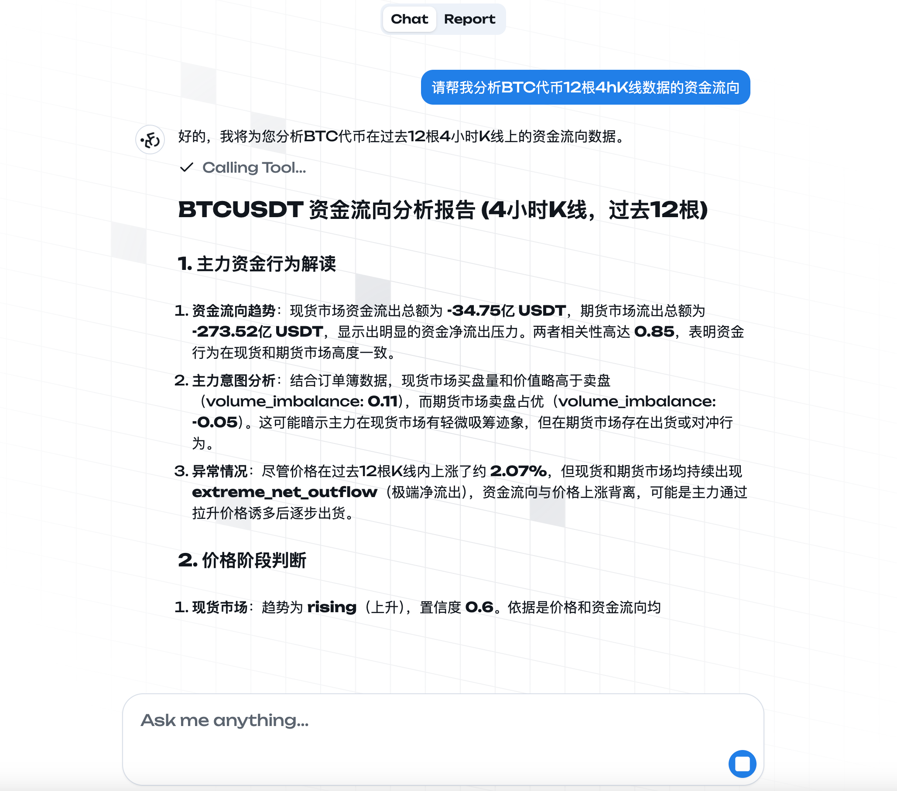
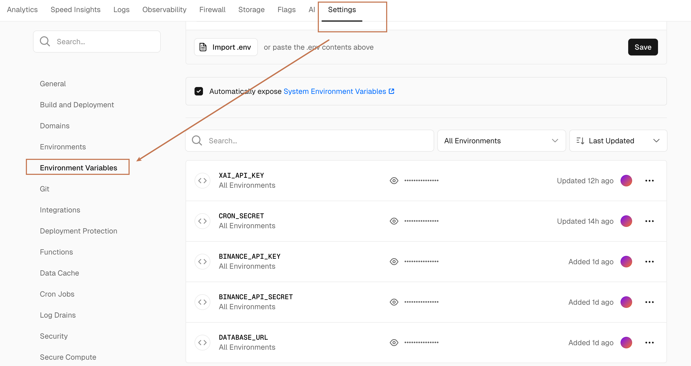
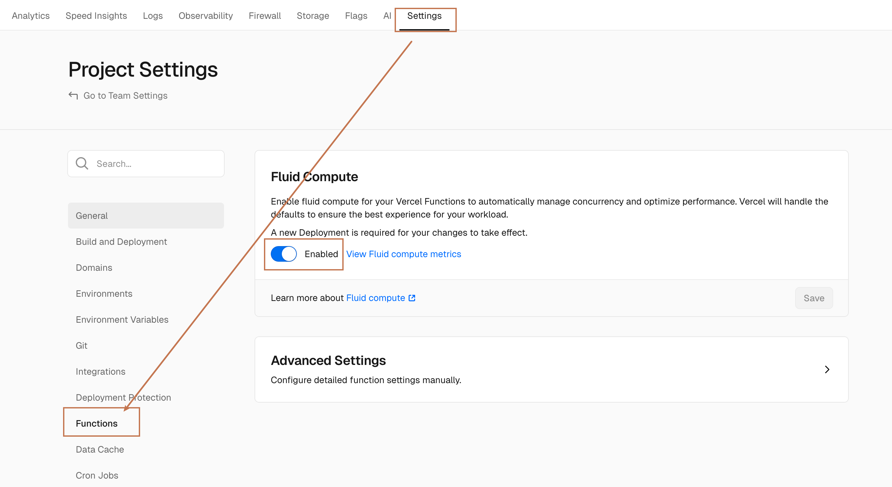
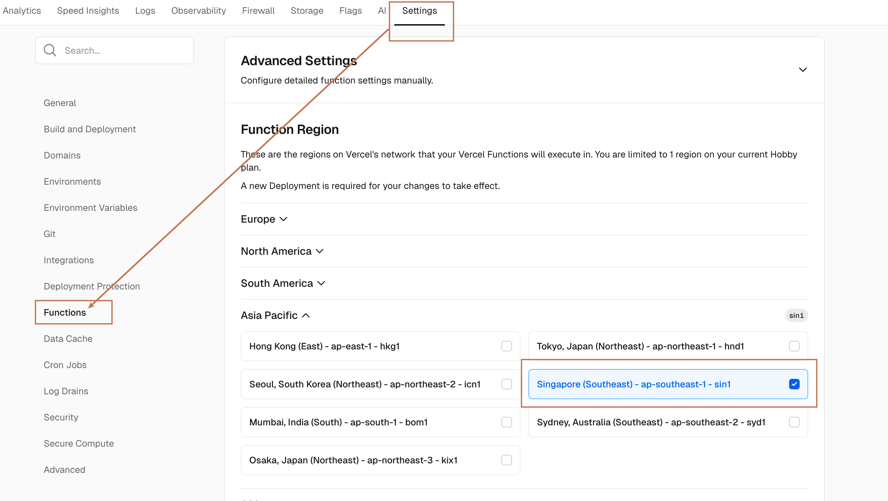

# Gabriel API
> 这是币安交易所数据分析AI助手 Gabriel 的 API



## 前端项目地址
https://github.com/xxxijustwei/gabriel-web

## 开始使用

### 安装


1. 克隆仓库:

   ```bash
   git clone https://github.com/xxxijustwei/gabriel-api.git
   cd gabriel-api
   ```

2. 安装依赖:

   ```bash
   bun install
   ```

3. 创建 `.env` 文件

   ```bash
   XAI_API_KEY="" # XAI API Key
   BINANCE_API_KEY="" # Binance API Key
   BINANCE_API_SECRET="" # Binance API Secret
   DATABASE_URL="" # PostgreSQL connection string
   CRON_SECRET="" # Cron secret
   ```

4. 启动开发服务器:

   ```bash
   bun run start:dev
   ```

4. 打开浏览器并访问 `http://localhost:8080`

## 部署到 Vercel

1. 安装 Vercel CLI

   ```bash
   bun install -g vercel
   ```

2. 登录 Vercel

   ```bash
   vercel login
   ```

3. 部署到 Vercel

   ```bash
   vercel --prod
   ```

4. 在 Vercel 仪表盘中设置环境变量
   ```bash
   XAI_API_KEY="" # XAI API Key
   BINANCE_API_KEY="" # Binance API Key
   BINANCE_API_SECRET="" # Binance API Secret
   DATABASE_URL="" # PostgreSQL connection string
   CRON_SECRET="" # Cron secret
   ```
   

5. 启用 **Fluid Compute**

   

6. 设置 Function Region 保证 Binance API 和 Grok API 在可用区域

   

7. 重新部署项目

   ```bash
   vercel --prod
   ```

## 定时分析任务
> 这是一个加密货币资金流向分析任务

### 任务逻辑

1. 从DB中获取任务配置 （symbol, interval, limit）
2. 调用 `analyzeFundingFlow` 函数进行交易所数据处理
3. 拉取最新一次的任务分析结果，如果存在，则将最新一次的分析结果作为上下文，与当前分析数据一起，生成新的分析结果
4. 使用 grok-3-fast 模型生成分析文本
5. 将分析文本存储到DB中


### 配置 Corn Job
> Usage & Pricing for Cron Jobs(Hobby Plan 最多每天触发一次): https://vercel.com/docs/cron-jobs/usage-and-pricing

1. 在 `vercel.json` 中配置 Corn Job:
    默认配置包含一个每天00:00（UTC）运行的任务，改任务会调用 `/api/task` 接口：
    > Cron Job 配置文档: https://vercel.com/docs/cron-jobs/manage-cron-jobs

    ```json
    {
        "crons": [
            {
                "path": "/api/task",
                "schedule": "0 0 * * *"
            }
        ]
    }
    ```
>

2. 安全

    Corn Job 端点 `/api/task` 受 `CRON_SECRET` 环境变量保护。确保您在 Vercel 环境设置中设置了此变量。
